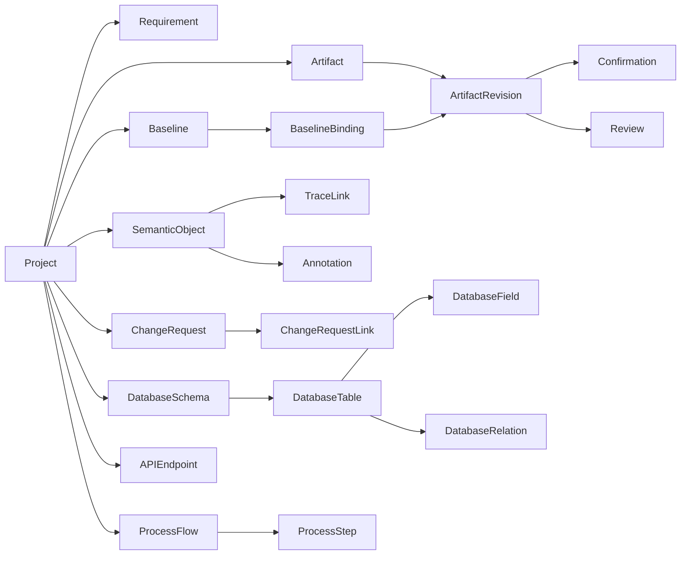

# Document Again — Canonical Domain Model

The P0 domain model is implemented in `backend/app/models.py` and
mapped to SQLite via SQLAlchemy 2 (25 tables, migration
`1286f0e54ef1`). This document describes *what* each entity is and
*why* it is shaped the way it is. Behavior (immutability, freezing,
cloning) is documented in the sibling model docs.

## Identity: two ID families

1. **Opaque entity IDs** — `prj_…`, `art_…`, `rev_…`, `bsl_…`, `sem_…`,
   `req_…`, `cr_…`. Internal primary keys. Stable, never reused,
   never shown as the primary identity.
2. **Canonical semantic IDs** — `REQ-0042`, `tbl_approval_history`,
   `fld_approval_history_approver_id`, `flow_purchase_approval`,
   `api_order_approve`, `DEC-0007`. These are the IDs used by
   TraceLink and Annotation anchors and the ones humans reason about.

Display names may change. IDs must not.

## Entity catalogue

| Entity | Table | Purpose |
|--------|-------|---------|
| Project | `projects` | Workspace root; owns everything below |
| Artifact | `artifacts` | Generic document/design container (UR, DR, schema, flow, …) |
| ArtifactRevision | `artifact_revisions` | The unit of confirmation; holds a frozen snapshot |
| Baseline | `baselines` | A named freeze of artifact→revision bindings |
| BaselineBinding | `baseline_bindings` | One frozen pair inside a baseline |
| Requirement | `requirements` | Canonical requirement, independent of generated text |
| SemanticObject | `semantic_objects` | Stable identity layer for trace + annotation |
| TraceLink | `trace_links` | Directed typed edge between semantic objects |
| Annotation | `annotations` | Comment/question/… anchored to a semantic object |
| CommentThread | `comment_threads` | Groups related annotations |
| Review | `reviews` | A review verdict on a revision |
| Confirmation | `confirmations` | Actor + time + comment + evidence for a confirm |
| ChangeRequest | `change_requests` | First-class change object that spawns revisions |
| ChangeRequestLink | `change_request_links` | Affected semantic objects of a CR |
| DatabaseSchema | `database_schemas` | Structured DB design container |
| DatabaseTable | `database_tables` | Structured table |
| DatabaseField | `database_fields` | Structured field (full metadata) |
| DatabaseRelation | `database_relations` | Structured FK relation between fields |
| ProcessFlow | `process_flows` | Structured process flow |
| ProcessStep | `process_steps` | Ordered step inside a flow |
| APIEndpoint | `api_endpoints` | Structured API endpoint |
| Decision | `decisions` | Recorded decision with semantic ID |
| Assumption | `assumptions` | Recorded assumption |
| Clarification | `clarifications` | Question/answer pair |
| Release | `releases` | Named release pointing at a baseline |

## Enum values

- **ArtifactType** — `REQUIREMENT_REGISTER, UR, DR, DATABASE_SCHEMA,
  ER_DIAGRAM, DATA_DICTIONARY, PROCESS_FLOW, ARCHITECTURE, API_DESIGN,
  WHITEBOARD, NOTE, CHANGE_REQUEST, DECISION`
- **RevisionStatus** — `DRAFT, IN_REVIEW, CONFIRMED, SUPERSEDED, ARCHIVED`
- **SemanticObjectType** — `REQUIREMENT, DOCUMENT_SECTION, DB_SCHEMA,
  DB_TABLE, DB_FIELD, DB_RELATION, PROCESS_FLOW, PROCESS_STEP,
  API_ENDPOINT, ARCHITECTURE_NODE, SCREEN`
- **TraceRelationType** — `DERIVED_FROM, IMPLEMENTS, DESIGNED_BY,
  VALIDATED_BY, AFFECTS, REFERENCES, SUPERSEDES, GENERATED_FROM,
  CONFIRMED_BY`
- **AnnotationType** — `COMMENT, QUESTION, CLARIFICATION, DECISION,
  ASSUMPTION, ISSUE, CHANGE_REQUEST`
- **AnnotationStatus** — `OPEN, REPLIED, RESOLVED, REOPENED`
- **RequirementStatus** — `DRAFT, IN_REVIEW, CONFIRMED, SUPERSEDED`
- **ChangeRequestStatus** — `OPEN, ACCEPTED, IMPLEMENTED, REJECTED, DEFERRED`

## Relationships and lifecycle intent

- **Artifact → ArtifactRevision** is one-to-many; a revision is the
  unit of confirmation, and an artifact tracks a current *draft*
  pointer (`current_draft_revision_id`).
- **Requirement** is canonical and independent: UR/DR documents
  *reference* requirements via semantic IDs; requirement truth is
  never stored only inside document text.
- **SemanticObject** decouples identity from both documents and
  structured rows (`entity_ref` points at the owning row, e.g. a
  `DatabaseField.id` or a `Requirement.id`).
- **Database design** is first-class structured data. The ER diagram
  and the data dictionary are *views* over it, not sources of truth.
- **ChangeRequest** links to affected semantic objects
  (`change_request_links`) and must lead to new revisions; it never
  mutates an old confirmed baseline.

## What is deliberately absent (P0)

`DesignObject` is represented generically by `Artifact` with a
`DOCUMENT_SECTION` semantic object where a section-level anchor is
needed. Task/schedule (PM) and test-result/verdict (QA) entities do
not exist here — those are other ecosystem products.
