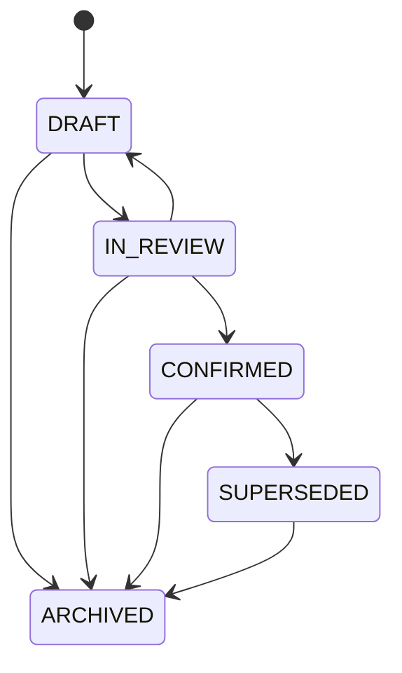

# Document Again — Revision & Baseline Model

The product's core promise: **a confirmed revision is immutable, and a
baseline freezes the exact revision bindings that existed at
confirmation time.** This document records exactly how that is
enforced.

## Revision lifecycle

```text
DRAFT        → editable
IN_REVIEW    → review / comment allowed
CONFIRMED    → immutable
SUPERSEDED   → historical, immutable, still readable
ARCHIVED     → historical
```

### State machine

Implemented in `backend/app/services.py`
(`_ALLOWED_TRANSITIONS`, `transition_revision`):



Any other transition raises `DomainError` ("Illegal transition …").

## Immutability

- `update_revision_snapshot` calls `require_editable`, which rejects
  anything that is not `DRAFT` with a 409 `DomainError`.
- `confirm_revision` accepts only `IN_REVIEW` (or `DRAFT`) and stamps
  `confirmed_at` / `confirmed_by`.
- The same rules are enforced at the HTTP edge (`/api/revisions/…`),
  so they cannot be bypassed through the API. The dogfood scenario
  verifies a PUT on a confirmed revision returns 409.

## Clone as new revision

Editing a confirmed artifact never mutates it. Instead:

- `create_revision` clones the latest (or an explicit
  `based_on_revision_id`) into a new `DRAFT` revision with
  `revision_number = max + 1`.
- The clone copies the parent snapshot verbatim and records
  `based_on_revision_id`, preserving ancestry.
- A DRAFT parent that is superseded by a newer draft pointer becomes
  `SUPERSEDED`.

## Confirmation → supersede

When a revision is confirmed, any previously `CONFIRMED` sibling of the
same artifact transitions to `SUPERSEDED`. It remains fully readable
(snapshot intact) and remains bound in every baseline that froze it.

## Baseline = frozen bindings, not a status flag

- `create_baseline` accepts only `CONFIRMED` revisions (one per
  artifact) and writes one immutable `baseline_bindings` row per pair.
- `resolve_baseline` re-reads those rows and **never** re-resolves to
  the artifact's latest revision.

```text
DR v1.0
├── Requirement snapshot #3
├── DB Schema snapshot #7
├── ERD snapshot #7
├── Process Flow snapshot #4
├── API Design snapshot #5
└── Whiteboard snapshot #11
```

If DB Schema later becomes v8, `DR v1.0` still resolves to v7.

### Invariant tests

Covered in `backend/tests/test_invariants.py`:

- `test_confirmed_revision_is_immutable`
- `test_confirming_again_is_rejected`
- `test_clone_preserves_ancestry`
- `test_clone_carries_latest_content_by_default`
- `test_baseline_retains_bound_child_revision`
- `test_baseline_rejects_unconfirmed_revisions`
- `test_new_child_revision_does_not_mutate_old_baseline`
- `test_superseded_history_readable`
- `test_illegal_transitions_rejected`
- `test_api_rejects_edit_of_confirmed_revision` (HTTP edge)
