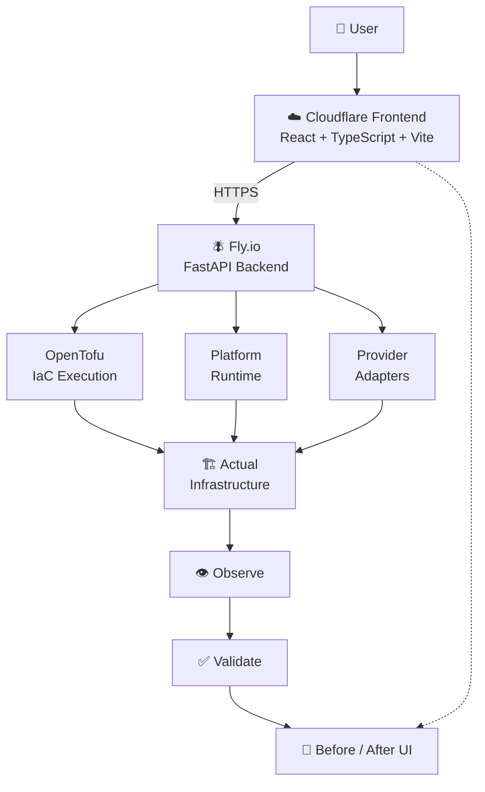

# INFRA-AGAIN Visual Operations & Deployment Architecture

## Full Stack Architecture



## Stack

| Layer | Technology | Deploy |
|---|---|---|
| Frontend | React + TypeScript + Vite | Cloudflare Pages |
| Backend | Python + FastAPI + Pydantic + Uvicorn | Fly.io |
| IaC Engine | OpenTofu v1.12.5 | Subprocess (Fly VM) |
| Persistence | SQLite | Fly Volume |
| Evidence | `.ai/infra-runs/` | Fly Volume |

## Local Development

```bash
# Backend
uvicorn infra_again.api:app --reload --port 8000

# Frontend
cd ui && npm run dev  # → http://localhost:5173 → proxies to :8000
```

## Production URLs

| Service | URL |
|---|---|
| Backend API | `https://infra-again.fly.dev` |
| Frontend | Cloudflare Pages (configure via `wrangler.toml`) |
